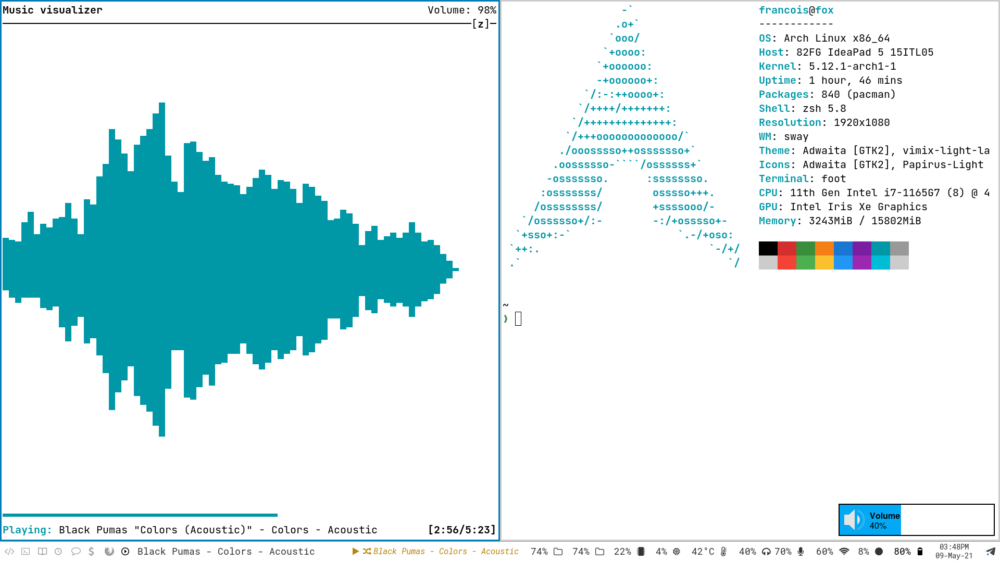

### Arch Linux setup

------
# My Stuff
#### Code Editor
| Package                                                                   | Description                                                                       |
|---------------------------------------------------------------------------|-----------------------------------------------------------------------------------|
| [Neovim](https://github.com/neovim/neovim)                                | Vim-fork focused on extensibility and usability                                   |
| [Coc](https://github.com/neoclide/coc.nvim)                               | Linter, Formatter and Autocomplete                                                |
| [Airline](https://github.com/vim-airline/vim-airline)                     | Beautiful StatusLine                                                              |
| [nnn.vim](https://github.com/mcchrish/nnn.vim)                            | Beautiful file manager                                                            |
| [fzf.vim](https://github.com/junegunn/fzf.vim)                            | Fzf for neovim                                                                    |

#### Fonts
| Package                                                                   | Description                                                                       |
|---------------------------------------------------------------------------|-----------------------------------------------------------------------------------|
| [Nerd Fonts](https://github.com/ryanoasis/nerd-fonts)                     | Iconic font aggregator, collection, & patcher                                     |
| [ttf-opensans](https://fonts.google.com/specimen/Open+Sans)               | Google font                                                                       |
| [ttf-jetbrains-mono](https://www.jetbrains.com/lp/mono/)                  | The must have icon theme                                                          |
| [ttf-meslo-nerd-font-powerlevel10k](https://github.com/romkatv/powerlevel10k-media) | Powerlevel10k recommanded font                                          |
| [noto-fonts-emoji](https://www.google.com/get/noto/help/emoji/)           | Font to get google emojis                                                         |
| [nerd-fonts-roboto-mono](https://github.com/ryanoasis/nerd-fonts/tree/master/patched-fonts/RobotoMono) | My polybar font                                      |

#### Design
| Package                                                                   | Description                                                                       |
|---------------------------------------------------------------------------|-----------------------------------------------------------------------------------|
| [Vimix](https://github.com/vinceliuice/vimix-gtk-themes)                  | Material GTK themes(compatible with all my apps not like some other themes...)    |
| [Papirus](https://github.com/PapirusDevelopmentTeam/papirus-icon-theme)   | The must have icon theme                                                          |

#### Sound
| Package                                                                   | Description                                                                       |
|---------------------------------------------------------------------------|-----------------------------------------------------------------------------------|
| [Pulseaudio](https://www.archlinux.org/)                                  | Sound server                                                                      |
| [Playerctl](https://github.com/acrisci/playerctl)                         | To control music on i3                                                            |
| [Pulseaudio-ctl](https://github.com/graysky2/pulseaudio-ctl)              | To adjust volume on i3                                                            |
| [Pavucontrol](https://freedesktop.org/software/pulseaudio/pavucontrol/)   | Graphical front-end to control pulseaudio                                         |

#### System
| Package                                                                   | Description                                                                       |
|---------------------------------------------------------------------------|-----------------------------------------------------------------------------------|
| [Arch Linux](https://www.archlinux.org/)                                  | The best distro ever!                                                             |
| [yay](https://github.com/Jguer/yay)                                       | An AUR Helper written in Go                                                       |
| [nvidia-lts]                                                              | Long time support Nvidia driver                                                   |
| [nvidia-dkms](https://github.com/hhfeuer/nvhda)                           | To patch custom kernels with an Nvidia GC                                         |

#### Terminal
| Package                                                                   | Description                                                                       |
|---------------------------------------------------------------------------|-----------------------------------------------------------------------------------|
| [Alacritty](https://github.com/alacritty/alacritty)                       | The best fatest terminal(powered by your graphic card)                            |
| [neofetch](https://github.com/dylanaraps/neofetch)                        | A fast, highly customizable system info script                                    |
| [Figlet](https://github.com/cmatsuoka/figlet)                             | ASCII banners in terminal                                                         |
| [lolcat](https://github.com/busyloop/lolcat)                              | Just because Unicorns exist                                                       |
| [htop](https://github.com/hishamhm/htop)                                  | Easier top                                                                        |
| [bpytop](https://github.com/aristocratos/bpytop)                          | Ressource monitor, with style                                                     |
| [cowfortune](https://github.com/anthraxx/cowfortune)                      | In case my quote python script break...                                           |

#### Utilities
| Package                                                                   | Description                                                                       |
|---------------------------------------------------------------------------|-----------------------------------------------------------------------------------|
| [Xorg](https://wiki.archlinux.org/index.php/Xorg)                         | Display server                                                                    |
| [Picom](https://wiki.archlinux.org/index.php/Picom)                       | Xorg compositor                                                                   |
| [efibootmgr]                                                              | required for uefi grub                                                            |
| [sudo](https://wiki.archlinux.org/index.php/Sudo)                         | System administrator to manage root users accesses                                |
| [Rofi](https://github.com/DaveDavenport/rofi)                             | A window switcher, application launcher and dmenu replacement                     |
| [sxiv](https://github.com/muennich/sxiv)                                  | Image viewer                                                                      |
| [sxiv-rifle](https://github.com/derf/feh)                                 | Script to browse through images for sxiv                                          |                                                                    
| [nnn](https://github.com/jarun/nnn)                                       | Light terminal file manager                                                       |
| [Flameshot](https://github.com/flameshot-org/flameshot)                   | Screenshot utility                                                                |
| [Xwallpaper](https://github.com/stoeckmann/xwallpaper)                    | Wallpaper setting utility for X                                                   |
| [Powertop](https://wiki.archlinux.org/index.php/Powertop)                 | Powertop Intel's tool to control and monitor battery                              |
| [xfce4-power-manager](https://docs.xfce.org/xfce/xfce4-power-manager/start) | Simple way to monitor battery status                                            |
| [Dunst](https://github.com/dunst-project/dunst)                           | Light but powerful notification daemon                                            |
| [NetworkManager](https://github.com/NetworkManager/NetworkManager)        | easiest tool to setup your network                                                |
| [Lxappearance](https://wiki.lxde.org/en/LXAppearance)                     | GTK style configuration tool(from LXDE)                                           |
| [Polybar](https://github.com/polybar/polybar)                             | Easy and beautiful status bar                                                     |
| [Dunst](https://wiki.archlinux.org/index.php/Dunst)                       | Notifications                                                                     |
| [Libnotify-id](https://aur.archlinux.org/packages/libnotify-id/)          | Modified package of libnotify to get IDs of notifications(used for my volume notification script) |
| [ImageMagick](https://imagemagick.org/index.php)                          | Image modifications utility                                                       |
| [Xclip](https://github.com/astrand/xclip)                                 | Copy-paste utility(used for Neovim)                                               |
| [numlockx]                                                                | numlock key enabled on X11 start(used with lightdm)                               |
| [handlr](https://github.com/chmln/handlr)                                 | Utility to set your default applications                                          |

#### Window Manager
| Package                                                                   | Description                                                                       |
|---------------------------------------------------------------------------|-----------------------------------------------------------------------------------|
| [i3-gaps](https://github.com/i3/i3)                                       | i3wm with few more features                                                       |

#### Display Manager
| Package                                                                   | Description                                                                       |
|---------------------------------------------------------------------------|-----------------------------------------------------------------------------------|
| [lightdm](https://github.com/canonical/lightdm)                           | Minimalist display manager                                                        |
| [https://github.com/prikhi/lightdm-mini-greeter](https://github.com/prikhi/lightdm-mini-greeter) | Minimalist greeter for lightdm (also used as lockscreen)   |

#### Useful Arch wiki links
| Package                                                                   | Description                                                                       |
|---------------------------------------------------------------------------|-----------------------------------------------------------------------------------|
| [Improving performance](https://wiki.archlinux.org/index.php/Improving_performance)| Best tips to improve system performances                                 |
| [Firefox tweaks](https://wiki.archlinux.org/index.php/Firefox/Tweaks)     | Tips to improve Firefox overall performances                                      |
| [PSD](https://wiki.archlinux.org/index.php/Profile-sync-daemon)           | Guide to enable Profile-sync-daemon                                               |
| [List of apps](https://wiki.archlinux.org/index.php/List_of_applications) | List of applications by categories                                                |
| [Kernel stuff](https://wiki.archlinux.org/index.php/Kernel)               | Mainpage of kernel related stuff                                                  |
| [systemd](https://wiki.archlinux.org/index.php/Systemd#Basic_systemctl_usage)| Guide about how to use systemctl                                               |
| [Font configuration](https://wiki.archlinux.org/index.php/Font_configuration)| All stuff about font configuration on archlinux                                |
| [EXT4](https://wiki.archlinux.org/index.php/Ext4)                         | Nice page about our sweet file system ext4 that handle all file transfers         |
| [MPV](https://wiki.archlinux.org/index.php/Mpv)                           | Open source, light and unbloat media player                                       |
| [Pacman tricks](https://wiki.archlinux.org/index.php/Pacman/Tips_and_tricks)| Some tricks to manage your beloved packages                                     |
| [Keybord configuration](https://wiki.archlinux.org/index.php/Xorg/Keyboard_configuration) | How to configure X11 keybord(to get the right keyboard layout)    |

------
> Thanks to [Mortezadadgar](https://github.com/mortezadadgar) for his help!
